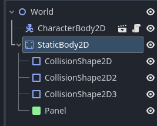

# Entry 2
##### 12/11/24

## **Context**:
Throughout the past few weeks since the last blog, I have been working on sharpening my skills with [Godot](https://godotengine.org/), which I have locked in on as my tool, to prepare for the city-building civilization game where I adjusted to use GDScript instead of C#. As I learned my tool, I used a [FreeCodeCamp tutorial](https://www.youtube.com/watch?v=S8lMTwSRoRg&t=2496s) to help me get started with world generation. Although it guided me through making a platformer game, I still learned a lot such as how to import [assets/arts packs](https://ansimuz.itch.io/sunny-land-pixel-game-art) and use them in my game.

## **What I have been doing in the past few weeks since 11/7/24**:

#### **Starting out a platformer game**:

```GDscript
extends Node2D


func _on_quit_pressed() -> void:
	get_tree().quit() # the tree is everything(basically a parent of root which is the parent of Main)


func _on_play_pressed() -> void:
	get_tree().change_scene_to_file("res://world.tscn") # Goes to the world scene
```

#### **Importing assets**:

Default template:

```GDscript
extends CharacterBody2D


const SPEED = 300.0
const JUMP_VELOCITY = -400.0


func _physics_process(delta: float) -> void:
	# Add the gravity.
	if not is_on_floor():
		velocity += get_gravity() * delta

	# Handle jump.
	if Input.is_action_just_pressed("ui_accept") and is_on_floor():
		velocity.y = JUMP_VELOCITY

	# Get the input direction and handle the movement/deceleration.
	# As good practice, you should replace UI actions with custom gameplay actions.
	var direction := Input.get_axis("ui_left", "ui_right")
	if direction:
		velocity.x = direction * SPEED
	else:
		velocity.x = move_toward(velocity.x, 0, SPEED)

	move_and_slide()
```
Note to self: make sure the files are children of the proper parent so that they do not act together, the floor was a child of Player so it had the same physics and therefore it fell due to the sprite(Player) falling physics. Here is the correct parent-child relationship to keep the static body from falling with the sprite:


#### **Integrating animation into game**:

```GDscript
# Animation
@onready var anim =get_node("AnimatedSprite2D") #onready is for accesing the variable on runtime
func _ready():
	anim.play("Idle")

# Game Physics
func _physics_process(delta: float) -> void:
	# Add the gravity.
	if not is_on_floor():
		velocity += get_gravity() * delta

	# Handle jump.
	if Input.is_action_just_pressed("ui_accept") and is_on_floor():
		velocity.y = JUMP_VELOCITY

	# Get the input direction and handle the movement/deceleration.
	# As good practice, you should replace UI actions with custom gameplay actions.
	var direction := Input.get_axis("ui_left", "ui_right")
	if direction:
		velocity.x = direction * SPEED
		anim.play("Run")
	else:
		velocity.x = move_toward(velocity.x, 0, SPEED)
		anim.play("Idle")
```
However, I will not be able to implement the jump animation into this code because the sprite is simutaneosly jumping and running at the same time. Thus, I must replace the `"AnimatedSprite2D"` from line 2 with `"AnimationPlayer"` which is a different object for animating the sprite. Another alternative is using the `AnimationTree` object

```GDscript
# Animation
@onready var anim =get_node("AnimationPlayer") #onready is for accesing the variable on runtime
func _ready():
	anim.play("Idle")

# Game Physics
func _physics_process(delta: float) -> void:
	# Add the gravity.
	if not is_on_floor():
		velocity += get_gravity() * delta
	# Handle jump.
	if Input.is_action_just_pressed("ui_accept") and is_on_floor():
		velocity.y = JUMP_VELOCITY
		anim.play("Jump")

	# Get the input direction and handle the movement/deceleration.
	# As good practice, you should replace UI actions with custom gameplay actions.
	var direction := Input.get_axis("ui_left", "ui_right")
	if direction == -1:
		get_node("AnimatedSprite2D").flip_h = true
	elif direction == 1: #else if
		get_node("AnimatedSprite2D").flip_h = false
	if direction:
		velocity.x = direction * SPEED
		if velocity.x == 0:
			anim.play("Run")
	else:
		velocity.x = move_toward(velocity.x, 0, SPEED)
		if velocity.y == 0:
			anim.play("Idle") #proper indents
	if velocity.y > 0:
		anim.play("Fall")
```
The newly added logic statements allow the sprite to look in the directions it is moving and features the jump and fall animation
However, the jump animation is still not rendering so I must use the logic between the velocity and when the sprite hits the floor which makes the velocity of y 0.

Here is the animation frames for the idle animation:


## **Plan**:
* Start the project by creating a repository that allows every member to contribute locally
* Make sure that there is a working menu to start the game
* Have at least some start to a world map


## **Sources**:

* [Assets pack](https://ansimuz.itch.io/sunny-land-pixel-game-art)
* [Godot reference](https://docs.godotengine.org/en/stable/tutorials/scripting/gdscript/gdscript_basics.html)
* [FreeCodeCamp tutorial](https://www.youtube.com/watch?v=S8lMTwSRoRg&t=2496s)

## **EDP**:

This is currently the second step of the engineering design process where I research the problem. After going through playing through some strategy, decision-impacting, and time-senstive games such as Hearts of Iron 4, Frost Punk 2, Clash of Clans, and Bloons TD6. Going through these favorite games of mine with a new lens of examination, I start planning on how I will be able toimplment some of their features I would love to have and gave me inspiration how I want the world to look like. This leads me into the next step of the engineering design process where I will brainstorm these ideas to prioritize which will be part of my MVP(minimal viable product) and which will be beyond it. However, setting a goal to get started with main world should be the main focus as I head into Winter Break.


## **Skills**:

Some skills that I have picked up while doing the first mini-project were **problem decomposition** and **time management** they worked well with each other since I had to break down the mini-project into separate parts while setting aside a short amount of time every week to make progress. I broke down the mini-project into first starting the world, then adding "assets" which are the sprites, and lastly animation in order to understand basic elements of Godot. 


[Previous](entry01.md) | [Next](entry03.md)

[Home](../README.md)
