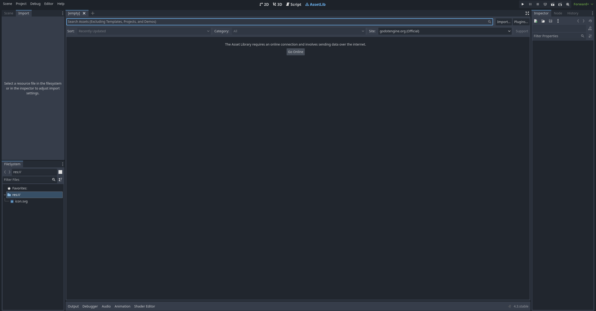
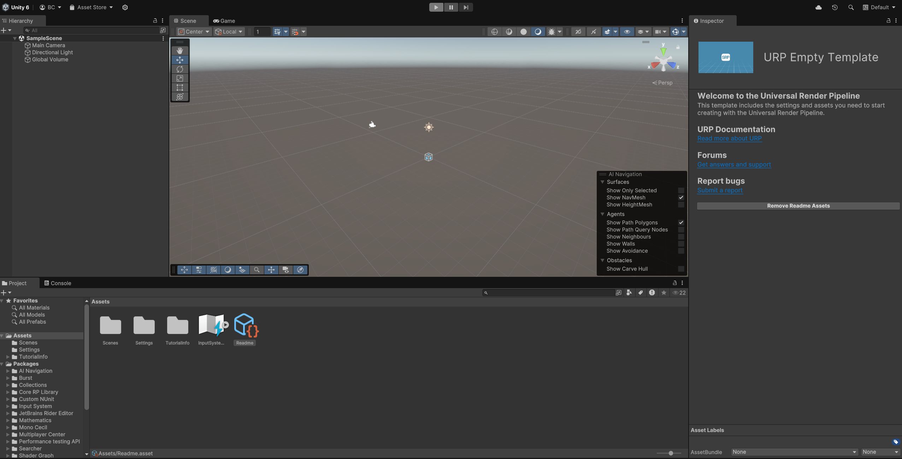
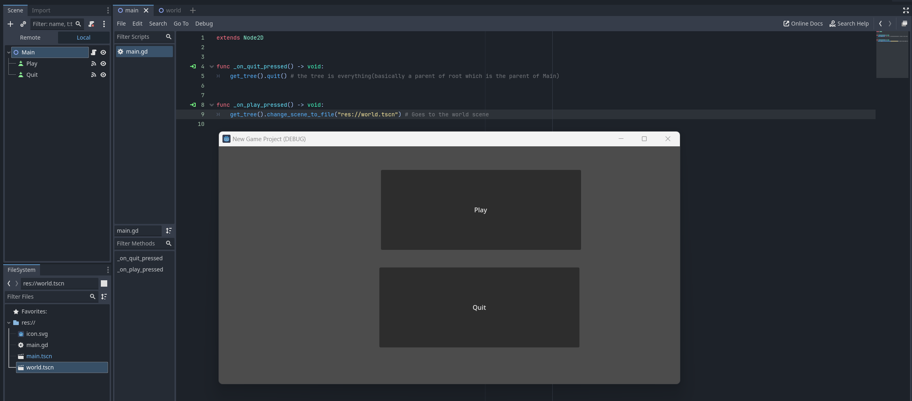
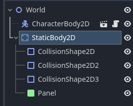

# Tool Learning Log

## Tool: **Unity**

## Project: **The New Settlement**

---

### 10/02/24: [Unity tutorial for Beginners](https://www.youtube.com/watch?v=XtQMytORBmM)
* Unity User Interface
  * Top left: hierarchy- Contains what happens in the scene, drag sprites up to create game object
  * Bottom: project- game elements such as sprites and scripts, usually imorted images
  * Top middle: scene- Basically the preview for what happens in the scene, select game view to see how the game will look like from user perspective
  * Left: Inspector- Manipulating game objects to perform actions and name the objects

### 10/14/24: [W3 Schools](https://www.w3schools.com/cs/index.php)
* Created a codespace by following the instructions on Get Started section and got this:
```C#
namespace HelloWorld
{
    internal class Program
    {
        static void Main(string[] args)
        {
        }
    }
}
```
Tried to replicate what w3school shows by copying `Console.WriteLine(Value);` but showed error and told me to declare a value to output it:
```C#
namespace HelloWorld
{
    internal class Program
    {
        private const string Value = "Hi";

        static void Main(string[] args)
        {
            Console.WriteLine(Value);
        }
    }
}
```
Notes so far:
* `Console.WriteLine();` is like `System.out.println();`
* C# is very similar to java since it is object-oriented

### 10/26/24: [Godot Showcase](https://godotengine.org/showcase/), [First game in Godot](https://www.youtube.com/watch?v=iwGVLiFL-Lw)
* Pros of switching to Godot:
 * Godot is very good for small companies or solo dev while Unity is mostly for game industry and big companies
 * Most people find Unity annoying while Godot is a lot more easier and more fun to code in
 * Skills are easily transferrable
 * everybody is using it so we can ask when need help
 * tutorials are much more recent



### 11/7/24: [Freecodecamp course](https://www.youtube.com/watch?v=S8lMTwSRoRg&t=923s)

The following basically serves as a menu to either exit the game or play the game(it's supposed to bring you to the World file scene which shows nothing so far):


This is my less developed game so far:

```GDscript
extends Node2D


func _on_quit_pressed() -> void:
	get_tree().quit() # the tree is everything(basically a parent of root which is the parent of Main)


func _on_play_pressed() -> void:
	get_tree().change_scene_to_file("res://world.tscn") # Goes to the world scene
```

I will be trying to find assets and already-drawn arts to move as sprites and continue testing them out.

### 11/7/24: [Freecodecamp course(continue)](https://www.youtube.com/watch?v=S8lMTwSRoRg&t=923s) & [Assets](https://ansimuz.itch.io/sunny-land-pixel-game-art)

Default template:

```GDscript
extends CharacterBody2D


const SPEED = 300.0
const JUMP_VELOCITY = -400.0


func _physics_process(delta: float) -> void:
	# Add the gravity.
	if not is_on_floor():
		velocity += get_gravity() * delta

	# Handle jump.
	if Input.is_action_just_pressed("ui_accept") and is_on_floor():
		velocity.y = JUMP_VELOCITY

	# Get the input direction and handle the movement/deceleration.
	# As good practice, you should replace UI actions with custom gameplay actions.
	var direction := Input.get_axis("ui_left", "ui_right")
	if direction:
		velocity.x = direction * SPEED
	else:
		velocity.x = move_toward(velocity.x, 0, SPEED)

	move_and_slide()
```
Note to self: make sure the files are children of the proper parent so that they do not act together, the floor was a child of Player so it had the same physics and therefore it fell due to the sprite(Player) falling physics. Here is the correct parent-child relationship to keep the static body from falling with the sprite:



<!--
* Links you used today (websites, videos, etc)
* Things you tried, progress you made, etc
* Challenges, a-ha moments, etc
* Questions you still have
* What you're going to try next
* Use ```GDscript``` for multi-line code snippets
* For images- 
-->
